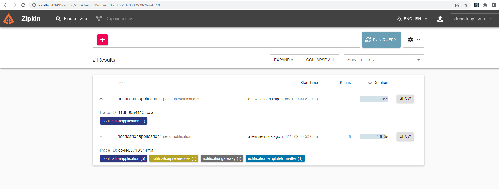
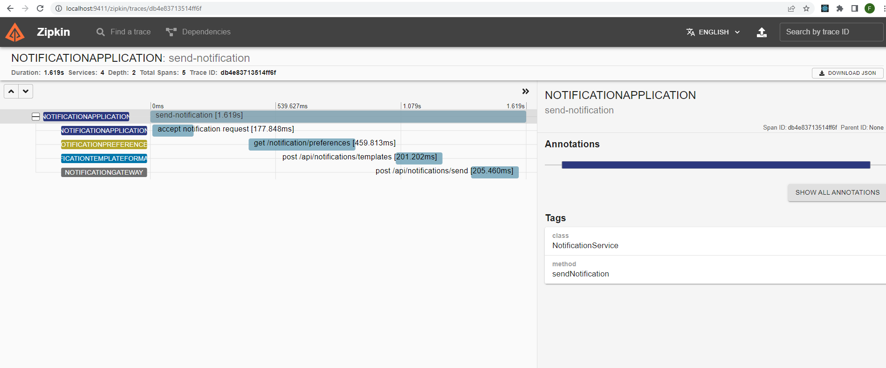
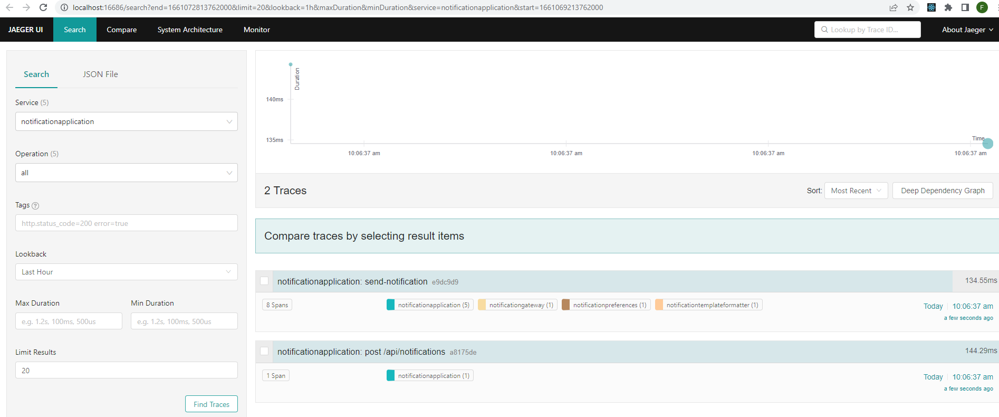
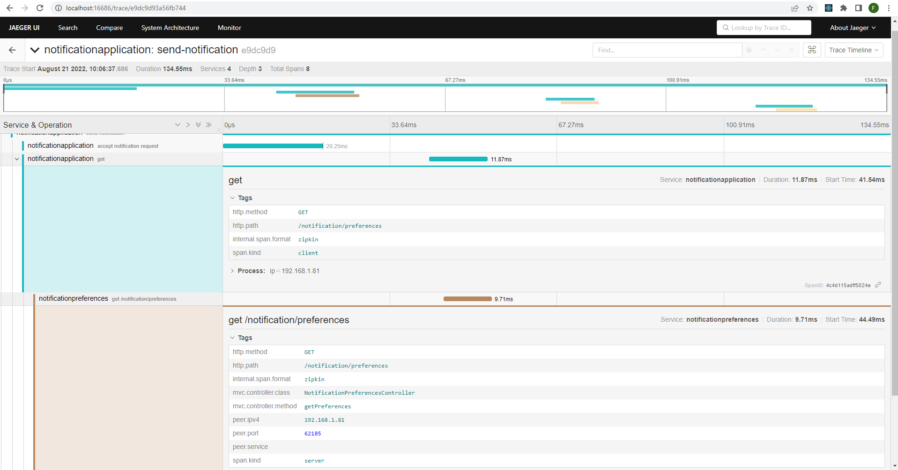
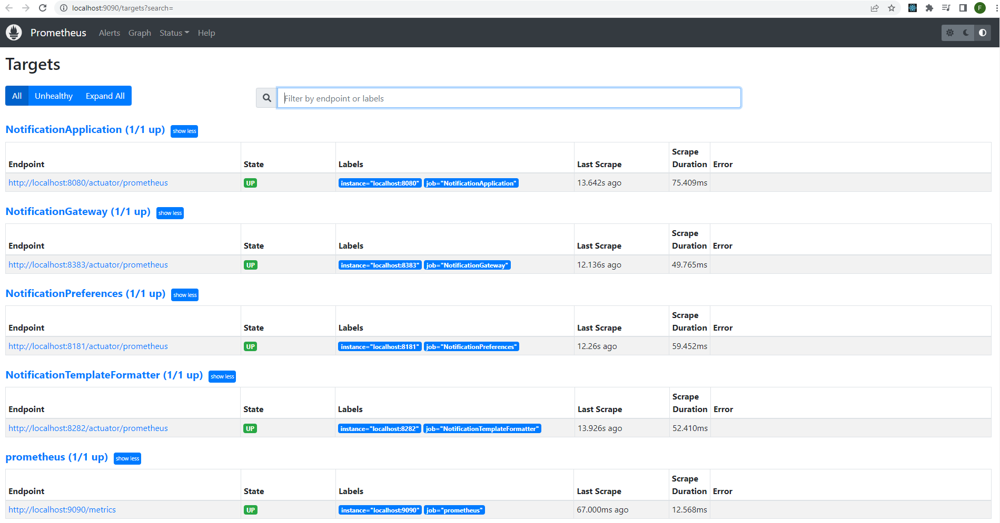
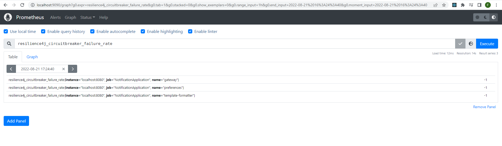
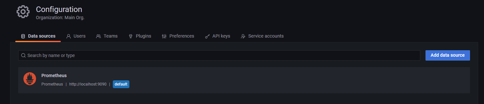
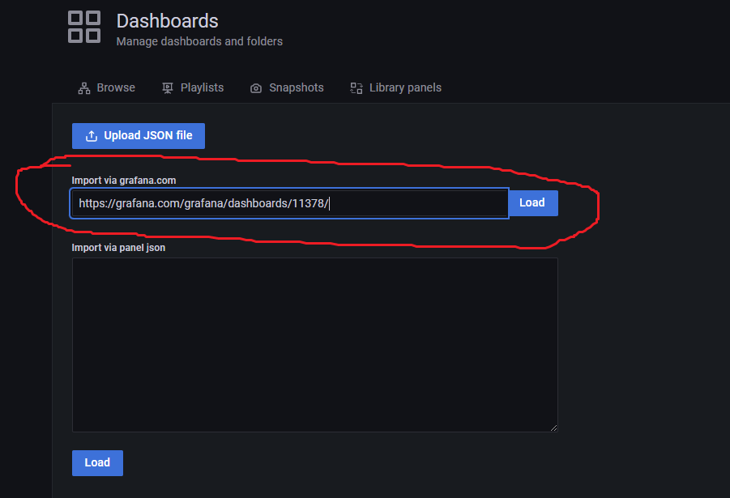
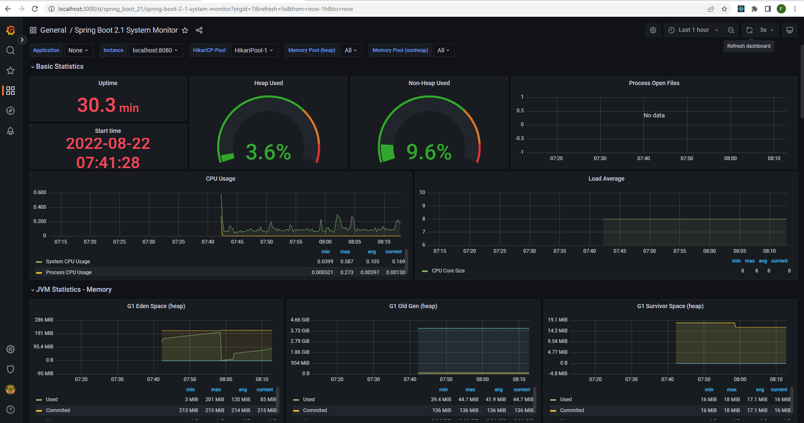

# Microservices Notification System

Implement a solution to handle the high-volume traffic of the bank’s notification management platform.

## Database console

H2 console -- http://localhost:8181/h2-console

JDBC URL -- jdbc:h2:mem:notificationsdb

## OpenAPI

### Notification Application
For JSON -- http://localhost:8080/v3/api-docs/

For UI -- http://localhost:8080/swagger-ui/index.html

### Notification Preferences
For JSON -- http://localhost:8181/v3/api-docs/

For UI -- http://localhost:8181/swagger-ui/index.html

### Notification Templates
For JSON -- http://localhost:8282/v3/api-docs/

For UI -- http://localhost:8282/swagger-ui/index.html

### Notification Gateway
For JSON -- http://localhost:8383/v3/api-docs/

For UI -- http://localhost:8383/swagger-ui/index.html

## Consul

Start agent
```shell
consul agent -server -bootstrap-expect=1 -data-dir=consul-data -ui -bind=127.0.0.1
```

Open web browser at http://localhost:8500/ui

## Distributed Tracing

### Zipkin
Download the latest version of [Zipkin](https://zipkin.io/) and run it from a command line.

```shell
curl -sSL https://zipkin.io/quickstart.sh | bash -s
java -jar zipkin.jar
```

Open the UI at http://localhost:9411

The __NotificationApplication__ uses [Spring Webflux](https://docs.spring.io/spring-framework/docs/current/reference/html/web-reactive.html)
and a non-blocking server (e.g. Netty).
As such, upon receiving a request the processing is executed asynchronously thus
we end up wih 2 separate traces:

* request received by Spring Webflux -- `post api/notifications`
* processing of Notification request -- `send-notification`





### Jaeger
Download the executable for your platform [Jaeger All in One](https://www.jaegertracing.io/docs/1.37/getting-started/#all-in-one)
and run it locally.

```shell
jaeger-all-in-one --collector.zipkin.host-port=:9411
```

Open the UI at http://localhost:16686





## Monitoring

### Prometheus
Download the executable for your platform [Prometheus](https://prometheus.io/download/).

Add to the `prometheus.yml` configuration file:

```yaml
  # The job names to connect to the Notification Spring Boot-based microservices
  - job_name: "NotificationApplication"
    metrics_path: "/actuator/prometheus"
    static_configs:
      - targets: ["localhost:8080"]

  - job_name: "NotificationPreferences"
    metrics_path: "/actuator/prometheus"
    static_configs:
      - targets: ["localhost:8181"]

  - job_name: "NotificationTemplateFormatter"
    metrics_path: "/actuator/prometheus"
    static_configs:
      - targets: ["localhost:8282"]

  - job_name: "NotificationGateway"
    metrics_path: "/actuator/prometheus"
    static_configs:
      - targets: ["localhost:8383"]
```

Now, run it locally.

```shell
prometheus --storage.tsdb.path=./data --config.file=./prometheus.yml
```

Open the UI at http://localhost:9090





### Grafana

Download the executable for your platform [Grafana](https://grafana.com/docs/grafana/latest/).

Start Grafana and on the Grafana Console http://localhost:3000 :

* Add a Data Source pointing to our local Prometheus instance (http://localhost:9090)



* Import a Dashboard definition from https://grafana.com/grafana/dashboards/11378/



When services are running then we can view their metrics via the imported dashboard:

